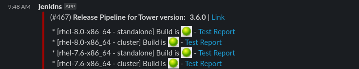
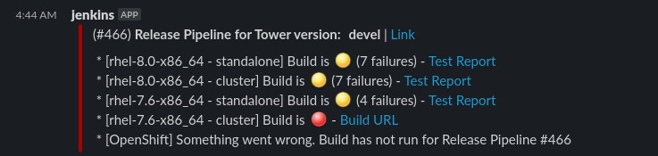

# Overview of QE Jenkins Jobs

* [Introduction](#introduction)
* [General Practices](#general-practices)
* [Release Verification](#release-verification)
* [Ansible Core Compatibility](#ansible-core-compatibility)
* [List of Jenkins jobs](#list-of-jenkins-jobs)
* [YOLO](#yolo)
* [FAQ](#faq)


## Introduction

Ansible Tower QE team relies Jenkins to manage the running of our automated tests.
[http://jenkins.ansible.eng.rdu2.redhat.com/view/Tower/](http://jenkins.ansible.eng.rdu2.redhat.com/view/Tower/)

In order to access the above link you will need to be on the Red Hat VPN. One logs in with his kerberos credentials.
If you are presented with a page saying Unauthorized, please reach out to Frank Jansen or Graham Mainwaring.

The QE team as a whole maintains the pipelines and jobs listed [below](#list-of-jenkins-jobs).
Also we have a [dashboard](http://tower-qe-dashboard.ansible.eng.rdu2.redhat.com/jenkins/releases), more information about it will be provided later on this document.
It is a good practice to take a look on the dashboard at least once a day to check how things are going for the current releases.


## General Practices

The Ansible Tower QE team follows a certain number of general practices so our code base remains consistent:

  * Every new job created should be a Jenkins **Declarative** Pipeline. Check [Jenkins Pipeline docs](https://jenkins.io/doc/book/pipeline/) for more information.
  * Every build step on the pipeline should be done in a shell script that one can run from his workstation. These scrips should be placed under the `tools/jenkins/scripts` directory, please check that directory for scripts already available.
  * No Jenkins specific feature should be used. We should be able to switch from Jenkins to any build system at any given time.
  * Unless you are certain nobody uses your Job, do not remove a job but move it to the Trash folder.
  * While creating a new pipeline, please create it in the [qe-sandbox](http://jenkins.ansible.eng.rdu2.redhat.com/job/qe-sandbox/) folder until it is ready.

## Daily Test Triage

In order to keep us in a state where we can ship Tower tower with confidence, we need to keep our test results green. Inevitably, bugs in Tower or tower-qa occur, or something else changes which causes test or pipeline failures. The best approach is to address these failures daily and assess what the cause of the failure (if any) was and take appropriate action.

In #ship_it and in #fortheloveofthegreen we get daily notificaitons of the nightly pipeline results on our "most important" platforms.

We like for this notification to look like this:


...but it is not uncommon for it to get like this:


What to do? First thing is first, we pass around daily triage of these tests results. A list of names/days can be found in title of #fortheloveofthegreen.

The triage person should inspect the test results of (first) these most basic builds and look to see if any patterns emerge. While the triage person should dedicate time to identifying the causes of the failures, they are not responsible for fixing them. They are responsible for finding people to fix them :D. Find people to own each failure. The goal is to keep green and keep this backlog as small as possible, so when it comes time for developers to run tests to verify their feature, or to release, the tests give a clear signal and we don't have to do alot of guessing at that time.

Types of problems to look out for:

* infra/network flake
* Regression in ansible -- e.g. fails w/ one version of ansible but not others. (note: default YOLO is devel, default nightly that is on message is latest stable)
* bug in tower/awx
     * file a bug! If fix in the works, that is enough. If not, make PR to skip test w/ github marker.
* new "feature" or removal of feature in awx/tower that was intentional, but broke tower-qa
    * update tests and let developer know what happened
* bug in tower-qa
    * fix test or file github issue in tower-qa
* test running against innappropriate environment
    * make sure appropriate fixtures to detect environment and skip based on that info are applied to tests

First thing to do is to identify if it is happening only on cluster or standalone, or only on openshift.

If there are obvious "owners" of the tests, ping them and see if they have time to investigate.

Otherwise, pick a test and log that you are working on it in #fortheloveofthegreen.

Attempt to reproduce the test failure in an appropriate environment, be that cluster, openshift, standalone, or locally in with a development environment.

If it is not reproducable, identify where the test is failing on jenkins and make PR to improve the error message if the error message does not provide enough context to understand what is going on.

If you idenitify a bug, file an issue in awx or tower depending on the nature of the bug. If fix is in the works, that is all you need to do. If it may take some time for the fix to land, make a PR to skip the test based on a github marker.

If the error has been occuring for multiple days and no fix is in the works, write up a tower-qa issue and provide all context you have on the issue. Raise issue to other QE and developers and see if you can get any movement on it. Label it as a bug and as high priority and add it to the QE project for the major release we are in. As a last resort, put a github mark on the tests and have it skip  to skip and add it to the 3.7 milestone. This is a last resort because we'd much rather keep green by fixing broken tests.

Reach out to code owners for the tests and try and delegate test failures to their respective owners. `git blame` is a valuable resource. Additionally, ping in #tower_api_internal to find a subject matter expert if tests are failing regarding a specific feature (e.g. all the rbac tests for workflows start failing suddenly).

Leave a log of your activiities in #fortheloveofthegreen so the next person on triage can address them.

Finally, if the main platforms are green or all failures are triaged, check the [dashboard](http://tower-qe-dashboard.ansible.eng.rdu2.redhat.com/jenkins/releases) to see all platforms results. Similar steps to the above should be followed to identify problems and get people working on fixes.


## Release Verification

One of our main goal in the Tower QE team is to ensure we ship great quality software in a timely manner.
To do that we want to have constant feedback about a release health during its development cycle, this is why
the Ansible Tower QE team runs the "final" release verification process nightly and ensure its always passing.

The actual job from Jenkins being triggered is the [Release Pipeline](http://jenkins.ansible.eng.rdu2.redhat.com/blue/organizations/jenkins/Pipelines%2Frelease-pipeline/activity) located in the [Pipelines folder](http://jenkins.ansible.eng.rdu2.redhat.com/job/Pipelines/) on Jenkins.
The code for this pipeline is availabe at [tools/jenkins/pipelines/release.groovy](https://github.com/ansible/tower-qa/blob/devel/tools/jenkins/pipelines/release.groovy)
This verification process consists of the following actions:

  * Building the various artifacts (RPM, Installer, Bundle Installer, Documentation, AMI Image, Vagrant Image)
  * Testing minor(from a z release to a z release) and major (from an older z release to a new y release) upgrade for all supported scenarios (bundle, non bundle, standalone, cluster)
  * Testing backup and restore for all supported scenarios (bundle, non bundle, standalone, cluster)
  * Running integration testing for all supported scenarios (bundle, non bundle, standalone, cluster)

The results of this process is available in our dashboard: http://tower-qe-dashboard.ansible.eng.rdu2.redhat.com/jenkins/releases

For each supported permutation of Operating System version and Ansible version, there is a colored orb that indicates the status of the latest pipeline run:

  * **Yellow**: All upgrades, backup and restore and installation went fine. Some failures have been observed while running the integration test suite.
  * **Red**: One or more of the upgrades, backup and restore or installation failed. It didn't get to running the integration test suite.
  * **Green**: Everything is OK and operational. You can move on !

By clicking on the status orb one will be directed to a Jenkins blue ocean view of the pipeline that one can interact with to get all the information one needs.

Not every permutation runs the full test suite, only the one that are run with latest Ansible stable version.
The other permutations will be run with the `yolo or ansible_integration` pytest filter.

As stated earlier, this release verification process is run on a timely manner, this is the logic used:

  * `devel`: nightly
  * Latest Released version ongoing maintenance release: nightly
  * Latest - 2: weekly
  * Latest - 3: weekly

This is an example of the cron definition at the time of the writing (`devel` being future `3.7.0`):

**Note**: This is the responsibility of all the team members to ensure those test remains green at all time or if not the team is aware of the reason why it can't be green.

```
H 18 * * * % TOWER_VERSION=devel
H 18 * * * % TOWER_VERSION=3.6.x
H H * * * % TOWER_VERSION=3.5.x
# H H * * 6 % TOWER_VERSION=3.4.x
# H H * * 7 % TOWER_VERSION=3.3.x
```

The older pipelines are commented out in the config and should be re-enabled when we near a patch release, as this may be several months apart, we don't run them as often.

Finally, when this pipeline is triggered, by default `latest` is selected as scope. This means only the latest versions of the supported Operating System are run.
If one wants to run **all** the supported Operating Systems, then one will need to choose `full` as the scope value.


## Ansible Core Compatibility

## FIXME This process uses old jobs/methods and we'd like to replace it with reporting results from our release pipelines https://github.com/ansible/tower-qa/issues/2410

Installs the latest release of Tower against Ansible development branches. Runs a subset of full integration that exercises the contact points between Tower and Ansible. Used by Tower team to sign-off on Ansible releases. A subset of the install / test jobs are triggered each night based on which development branches were changed in the past day.

- Ansible build jobs (maintained by Ansible Core team)
  - [Stable_Ansible](http://jenkins.ansible.eng.rdu2.redhat.com/view/Ansible/job/Stable_Ansible/) / [Nightly_Ansible](http://jenkins.ansible.eng.rdu2.redhat.com/view/Ansible/job/Nightly_Ansible/) - trigger downstream build / install / test jobs
  - [Build_Ansible_TAR](http://jenkins.ansible.eng.rdu2.redhat.com/view/Ansible/job/Build_Ansible_TAR/)
  - [Build_Ansible_Public_RPM](http://jenkins.ansible.eng.rdu2.redhat.com/view/Ansible/job/Build_Ansible_Public_RPM/)
  - [Build_Ansible_DEB](http://jenkins.ansible.eng.rdu2.redhat.com/view/Ansible/job/Build_Ansible_DEB/)
- [Ansible_Tower_Integration_Install](http://jenkins.ansible.eng.rdu2.redhat.com/view/Tower/job/Ansible_Tower_Integration_Install/)
- [Ansible_Tower_Integration_Test](http://jenkins.ansible.eng.rdu2.redhat.com/view/Tower/job/Ansible_Tower_Integration_Test/)

## List Of Jenkins Jobs

### Maintained by the Ansible Tower QE team

This is the list of jobs the Ansible Tower QE team maintains.

#### [Pipelines/Backup And Restore](http://jenkins.ansible.eng.rdu2.redhat.com/job/Pipelines/job/backup-and-restore-pipeline/)

This [pipeline](https://github.com/ansible/tower-qa/blob/devel/tools/jenkins/pipelines/backup-and-restore.groovy) will exercise the Backup and Restore scenario. It takes the following actions:

  * Install Tower
  * Load a dataset
  * Backup the Tower instance
  * Remove and reinstall a fresh Tower instance
  * Restore the dataset
  * Verify the integrity of the dataset

#### [Pipelines/Brew](http://jenkins.ansible.eng.rdu2.redhat.com/job/Pipelines/job/brew-pipeline/)

This [pipeline](https://github.com/ansible/tower-qa/blob/devel/tools/jenkins/pipelines/brew.groovy) will run the brew related build actions:

  * Build Tower RPM in Brew
  * Build Tower Container in Brew
  * Push the built container in our own registry

For more information about Brew, check this [document](https://mojo.redhat.com/docs/DOC-1024827).

#### [Pipelines/Build Artifacts](http://jenkins.ansible.eng.rdu2.redhat.com/job/Pipelines/job/build-artifacts-pipeline/)

This [pipeline](https://github.com/ansible/tower-qa/blob/devel/tools/jenkins/pipelines/build-artifacts.groovy) will build the miscellaneous artifacts we ship as part of a release:

  * Build Tower Documentation
  * Build Tower Vagrant image
  * Build Tower Amazon AMI

#### [Pipelines/Debian](http://jenkins.ansible.eng.rdu2.redhat.com/job/Pipelines/job/debian-pipeline/)

This [pipeline](https://github.com/ansible/tower-qa/blob/devel/tools/jenkins/pipelines/debian.groovy) is not meant to be run directly but via the `Pipeline/Release` pipeline.
It defines which Operating System to run the `Pipeline/Dispatch` for. If `latest` is selected as scope, only Ubuntu 16.04 will get selected
while, if `full` is selected and the Tower version supports it, Ubuntu 14.04 would also be selected.

**Note**: Ubuntu support was deprecated starting from Tower `3.6.0`.

#### [Pipelines/Dispatch](http://jenkins.ansible.eng.rdu2.redhat.com/job/Pipelines/job/dispatch-pipeline/)

This [pipeline](https://github.com/ansible/tower-qa/blob/devel/tools/jenkins/pipelines/dispatch.groovy) is not meant to be run directly but via the `Pipeline/Release` pipeline.
It defines which Ansible Version to run the `Pipeline/Verification` for based on the supported version of Ansible for a given version of Ansible Tower.

#### [Pipelines/Install](http://jenkins.ansible.eng.rdu2.redhat.com/job/Pipelines/job/install-pipeline/)

This [pipeline](https://github.com/ansible/tower-qa/blob/devel/tools/jenkins/pipelines/install.groovy) will run an install of Ansible Tower based on the selected parameters.

#### [Pipelines/Install and Integration](http://jenkins.ansible.eng.rdu2.redhat.com/job/Pipelines/job/integration-pipeline/)

This [pipeline](https://github.com/ansible/tower-qa/blob/devel/tools/jenkins/pipelines/integration.groovy) will run an install of Ansible Tower based on the selected parameters and run the test suite.

#### [Pipelines/Layered Product Testing](http://jenkins.ansible.eng.rdu2.redhat.com/job/Pipelines/job/lptesting-main-pipeline/)

This [pipeline](https://github.com/ansible/tower-qa/blob/devel/tools/jenkins/pipelines/lptesting-main.groovy) is used to validate an upcoming version of RHEL to the Interop team.
It is a meta pipeline, it simply, based on the RHEL_COMPOSE_ID, call the proper [Pipelines/Layered Product Testing (permutation)](http://jenkins.ansible.eng.rdu2.redhat.com/job/Pipelines/job/lptesting-pipeline/) jobs. More on Interop Testing available [here](how_to_test_compatibility_with_rhel_prereleases.md).

#### [Pipelines/Layered Product Testing (permutation)](http://jenkins.ansible.eng.rdu2.redhat.com/job/Pipelines/job/lptesting-pipeline/)

This [pipeline](https://github.com/ansible/tower-qa/blob/devel/tools/jenkins/pipelines/lptesting.groovy) is used to validate an upcoming version of RHEL to the Interop team. It does the following actions:

  * Deploy a RHEL VM on our internal OpenStack
  * Prepare the node to point to the proper repositories
  * Install the specified version of Ansible Tower
  * Run a test

#### [Pipelines/OpenShift](http://jenkins.ansible.eng.rdu2.redhat.com/job/Pipelines/job/openshift/)

This [pipeline](https://github.com/ansible/tower-qa/blob/devel/tools/jenkins/pipelines/openshift.groovy) is used to validate the health of the OpenShift jobs. It does the following actions:

  * OpenShift Minor Upgrade
  * OpenShift Major Upgrade
  * OpenShift Backup And Restore
  * OpenShift Integration

#### [Pipelines/OpenShift Install](http://jenkins.ansible.eng.rdu2.redhat.com/job/Pipelines/job/openshift-install-pipeline/)

This [pipeline](https://github.com/ansible/tower-qa/blob/devel/tools/jenkins/pipelines/openshift-install.groovy) is used to deploy a Tower instance in the OpenShift platform.

#### [Pipelines/OpenShift Integration](http://jenkins.ansible.eng.rdu2.redhat.com/job/Pipelines/job/openshift-integration-pipeline/)

This [pipeline](https://github.com/ansible/tower-qa/blob/devel/tools/jenkins/pipelines/openshift-integration.groovy) is used to deploy a Tower instance in the OpenShift platform and run the integration test suite.

#### [Pipelines/OpenShift Backup And Restore](http://jenkins.ansible.eng.rdu2.redhat.com/job/Pipelines/job/openshift-backup-and-restore-pipeline/)

This [pipeline](https://github.com/ansible/tower-qa/blob/devel/tools/jenkins/pipelines/openshift-install.groovy) is used to run the backup and restore scenario on an OpenShift deployment.
It reuses the exact same steps and scripts the packages based pipeline uses.

#### [Pipelines/OpenShift Upgrade](http://jenkins.ansible.eng.rdu2.redhat.com/job/Pipelines/job/openshift-upgrade/)

This [pipeline](https://github.com/ansible/tower-qa/blob/devel/tools/jenkins/pipelines/openshift-upgrade.groovy) is used to run an upgrade scenario on an OpenShift deployment.
It reuses the exact same steps and scripts the packages based pipeline uses.

#### [Pipelines/Red Hat](http://jenkins.ansible.eng.rdu2.redhat.com/job/Pipelines/job/redhat-pipeline/)

This [pipeline](https://github.com/ansible/tower-qa/blob/devel/tools/jenkins/pipelines/redhat.groovy) is not meant to be run directly but via the `Pipeline/Release` pipeline.
It defines which Operating System to run the `Pipeline/Dispatch` for. If `latest` is selected as scope, only `RHEL 7.latest` will get selected
while, if `full` is selected and the Tower version supports it, `RHEL 7.latest-1` would also be selected.

#### [Pipelines/Release](http://jenkins.ansible.eng.rdu2.redhat.com/job/Pipelines/job/release-pipeline/)

This [pipeline](https://github.com/ansible/tower-qa/blob/devel/tools/jenkins/pipelines/release.groovy) is meant to verify the health of the release. It  will run the `Pipeline/Verification` pipeline for all supported OS/Ansible permutation based on the selected `scope`.

#### [Pipelines/Upgrade](http://jenkins.ansible.eng.rdu2.redhat.com/job/Pipelines/job/upgrade-pipeline/)

This [pipeline](https://github.com/ansible/tower-qa/blob/devel/tools/jenkins/pipelines/upgrade.groovy) will exercise the Upgrade scenario. It takes the following actions:

  * Install Tower
  * Load a dataset
  * Upgrade Tower
  * Verify the integrity of the dataset

#### [Pipelines/Verification](http://jenkins.ansible.eng.rdu2.redhat.com/job/Pipelines/job/verification-pipeline/)

This [pipeline](https://github.com/ansible/tower-qa/blob/devel/tools/jenkins/pipelines/verification.groovy) is meant to verify the health of a given permutation for a release. It will run all needed scenario to validate a release:

  * Minor upgrade (bundle, non-bundle, standalone, cluster)
  * Major upgrade (bundle, non-bundle, standalone, cluster)
  * Backup And Restore (bundle, non-bundle, standalone, cluster)
  * Integration test suite(bundle, non-bundle, standalone, cluster)

#### [qe-issue-bot](http://jenkins.ansible.eng.rdu2.redhat.com/view/Tower/job/qe_issue_bot/)

This job aims to send the team a Slack message on the #ship_it channel with current issue status on the various on-going releases.

It is a good practice to check if there is any `needs_test` issue that you can help verify. That is because when the release time comes, we would have just a feel issues to verify.


#### [Test_Tower_E2E_Pipeline](http://jenkins.ansible.eng.rdu2.redhat.com/job/Test_Tower_E2E_Pipeline/) - Runs the e2e ui tests

  * Trigger: checks for scm changes against tower/release_X every 2 hours.
  * Build: Builds RPM
  * Deploy: Uses the Ansible Tower Jenkins plugin to deploy a RPM build to GCE
  * Test: Runs the Test_Tower_E2E job against the GCE build
  * Notify: Sends a slack notification to #e2e-resuts and notifies of failure or return-to-success in #ui-talk

#### [Test_Tower_E2E](http://jenkins.ansible.eng.rdu2.redhat.com/job/Test_Tower_E2E/) - General E2E test execution utility job. Requires a FQDN, username, password
Used as a part of the Test_Tower_E2E_Pipeline
Used after the Openshift Integration runs
Soon: Used post-upgrade pipeline

### Not maintained by the Ansible Tower QE team

This is a list of jobs the Ansible Tower QE team does not maintain per-se but consumes for the aforementioned pipelines.

#### [Build Tower Bundle TAR](http://jenkins.ansible.eng.rdu2.redhat.com/view/Tower/job/Build_Tower_Bundle_TAR/)

Job responsible to build the bundle installer.
**Note**: [Build Tower Dependency Repo](http://jenkins.ansible.eng.rdu2.redhat.com/view/Tower/job/Build_Tower_Dependency_Repo/) should be run first if any dependency has been updated at the errata level.

#### [Build Tower DEB](http://jenkins.ansible.eng.rdu2.redhat.com/view/Tower/job/Build_Tower_DEB/)

Job responsible to build the Ubuntu apt packages. **Note**: Deprecated starting from `3.6.0`.

#### [Build Tower Dependency Repo](http://jenkins.ansible.eng.rdu2.redhat.com/view/Tower/job/Build_Tower_Dependency_Repo/)

Job responsible to pull the proper dependencies in the [nightly repo](http://nightlies.testing.ansible.com/ansible-tower_nightlies_m8u16fz56qr6q7/dependencies/).

#### [Build Tower Docs](http://jenkins.ansible.eng.rdu2.redhat.com/view/Tower/job/Build_Tower_Docs/)

Job responsible to build the Ansible Tower documentation.

#### [Build Tower Image](http://jenkins.ansible.eng.rdu2.redhat.com/view/Tower/job/Build_Tower_Image/)

Job responsible to build the Ansible Tower Amazon AMI.

#### [Build Tower OpenShift_TAR](http://jenkins.ansible.eng.rdu2.redhat.com/view/Tower/job/Build_Tower_OpenShift_TAR/)

Job responsible to build the Ansible Tower OpenShift installer.

#### [Build Tower RPM](http://jenkins.ansible.eng.rdu2.redhat.com/view/Tower/job/Build_Tower_RPM/)

Job responsible to build the Red Hat yum packages.

#### [Build Tower TAR](http://jenkins.ansible.eng.rdu2.redhat.com/view/Tower/job/Build_Tower_TAR/)

Job responsible to build the Ansible Tower installer.

#### [Build Tower Vagrant_Box](http://jenkins.ansible.eng.rdu2.redhat.com/view/Tower/job/Build_Tower_Vagrant_Box/)

Job responsible to build the Ansible Tower Vagrant box.

## YOLO

Yes. You read this title right: Yolo ! What is Yolo ? [Yolo](http://jenkins.ansible.eng.rdu2.redhat.com/view/Tower/job/Test_Tower_Yolo_Express/) (full name: Test_Tower_Yolo_Express), is a pipeline mainly targeted at the Devs and QE side to be able to "compose" a deployment with all the component one needs. One can specify:

  * To deploy Tower or AWX (upstream version of Tower)
  * Tower/AWX fork and branch
  * `ansible/tower-qa` fork and branch
  * `ansible/tower-packaging` fork and branch
  * `ansible/towerkit` fork and branch
  * `ansible/runner` fork and branch


Based on the option selected YOLO can:

  * Build Package
  * Deploy Tower
  * Run Integration Suite
  * Run E2E Suite

**Note**: When referring to YOLO one can hear two terms:

  * **YOLO**: Test suite is run with `yolo or ansible_integration` filter (~300 tests | ~1h20)
  * **SLOWYO**: Test suite is run without filter (~ 3110 tests | ~6h)


## FAQ

* _When is the last time we were testing Tower version X.Y.Z with Ansible version X.Y.Z on OS X version Z and what were the results_

As stated in [Release Verification](#release-verification), current devel and latest-released-version maintenance releases verification process happens nightly, for the oldest version it happens weekly.

The information is available here: http://tower-qe-dashboard.ansible.eng.rdu2.redhat.com/jenkins/releases - at most it would be 1 week old.

* _If I want to trigger a test of Tower version X.Y.Z with Ansible Version X.Y.Z on OS X version Z, how do I do that?_

Use the [YOLO](http://jenkins.ansible.eng.rdu2.redhat.com/job/Test_Tower_Yolo_Express/) job if you require a feature branch

* _We don't run full integration on all Ansible versions, right?_

Not during the release verification process. Full integration is run with latest ansible version on each OS. The rest run `-m yolo or ansible_integration`.
The `yolo` mark is a mark we have attempted to apply to get a minimum coverage of each component in Tower. The `ansible_integration` mark as been applied to tests known to expose our sensitive points of contact with breaking changes in Ansible.

* _How do you find results?_

Look at the [dashboard](http://tower-qe-dashboard.ansible.eng.rdu2.redhat.com/jenkins/releases) to find latest results for OS/Ansible version of interest.

* _How do I tell how many times a test has failed in the nightly runs?_

The # in the test results is calculated based on job #’s  -- can be misleading
Example: will say “failing for 25 builds” but actually it is only last night and tonight
Because other jobs happened in between, incrementing the job #’s, but these were not runs from the nightly pipeline
For a more accurate view, look at the particular test and then inspect the history (button on left when in detail view)


* _How can I inspect the health of a current feature in the test results?_

Expand “all test results” and click through the tree. Tests are organized by module and/or folder, each associated with a feature or function.
