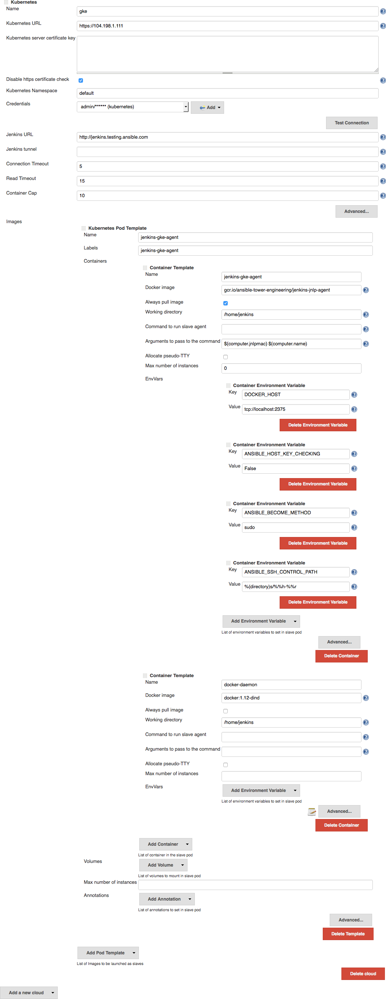

This is essentially [`jenkinsci/docker-jnlp-slave`](https://github.com/jenkinsci/docker-jnlp-slave) with some added goodness.

The goodness is as follows:

- `ansible`, `ansible-playbook`, etc
- `docker` & `docker-compose`
- `kubectl`

### Why does this container image exist?

This is an alternative to the strategy used in `jenkins-swarm-agent`. Now that the Jenkins Kubernetes Plugin supports [multiple containers](https://github.com/jenkinsci/kubernetes-plugin/pull/67), it makes this a feasible (probably preferable) approach because the agents come online, do their work, and then die. This means a fresh environment on every build.

### Building the image

```shell
$ cd tools/docker/jenkins/jenkins-jnlp-agent
$ docker build -t gcr.io/ansible-tower-engineering/jenkins-jnlp-agent .
```

### Pushing the image

```shell
$ gcloud docker push gcr.io/ansible-tower-engineering/jenkins-jnlp-agent
```

### Configuration

See the [Kubernetes Plugin] README for configuration instructions.

Our current configuration looks like:



### Optimizing image size

The resulting image is quite large (~515 MB). This isn't too bad since it is cached at the node level, but to cut off about ~150 MB, flatten the image. There are multiple ways of doing this, but I use [`docker-squash`](https://github.com/goldmann/docker-squash):

```shell
$ docker-squash gcr.io/ansible-tower-engineering/jenkins-jnlp-agent \
    -t gcr.io/ansible-tower-engineering/jenkins-jnlp-agent
$ $ gcloud docker push gcr.io/ansible-tower-engineering/jenkins-jnlp-agent
```
